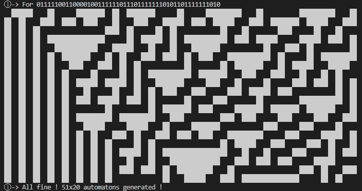

### Z1DCellularAutomata
Simple representation of a cellular automaton following the rules established by Stephen Wolfram. This code won't show you a representation in the form of a triangle, but rather in the form of a rectangle or square.

### Explanation
Choose a rule configuration `rules/mod.rs:11` (i know it's hard work but until i update it'll be like this)

| Binary representation | State conversion                                       |
|-----------------------|--------------------------------------------------------|
| 0                     | ALIVE.                                                 |
| 1                     | DEAD.                                                  |

example with rules 30 (0001 1110).
```rust
match (prev, curr, next) {
    (State::ALIVE, State::ALIVE, State::ALIVE) => State::DEAD,
    (State::ALIVE, State::ALIVE, State::DEAD) => State::ALIVE,
    (State::ALIVE, State::DEAD, State::ALIVE) => State::ALIVE,
    (State::ALIVE, State::DEAD, State::DEAD) => State::DEAD,
    (State::DEAD, State::ALIVE, State::ALIVE) => State::DEAD,
    (State::DEAD, State::ALIVE, State::DEAD) => State::ALIVE,
    (State::DEAD, State::DEAD, State::ALIVE) => State::ALIVE,
    (State::DEAD, State::DEAD, State::DEAD) => State::DEAD,
}
```

Now there are two solutions: either you submit a set of cellular automata to the `WCAStorage` constructor, or you add the automata one by one to the `WCAStorage` structure.

For the option n.1, create an sequence of `State` store in `Vec<State>`.

```txt
|sequence| > 3
```

```rust
let sequence: Vec<State> = vec![State::ALIVE,State::DEAD, ...];
```

Instantiate `WCAStorage` by giving it the list as an argument (if you have one).
```rust
let mut container: WCAStorage = WCAStorage::new(Some(sequence));
```
or
```rust
let mut container: WCAStorage = WCAStorage::new(None);
container.push(State::DEAD)
container.push(State::ALIVE)
...
```

You can now start the simulation with `WCAStorage::run(n-step) -> Result<Flag, &'static str>`
```rust
container.run(20) //for 20 steps.
```


### Licence
This project is licensed under the MIT License - see the LICENSE file for details.

### Contact
If you have any questions or encounter any issues, please open an issue on the GitHub repository at https://github.com/lalBi94/Z1DCellularAutomata/issues or send an email to bilal.boudjemline@etu.u-pec.fr.